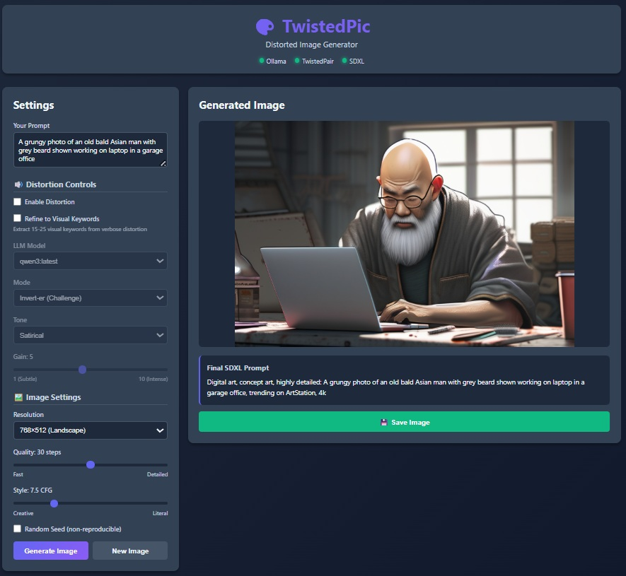
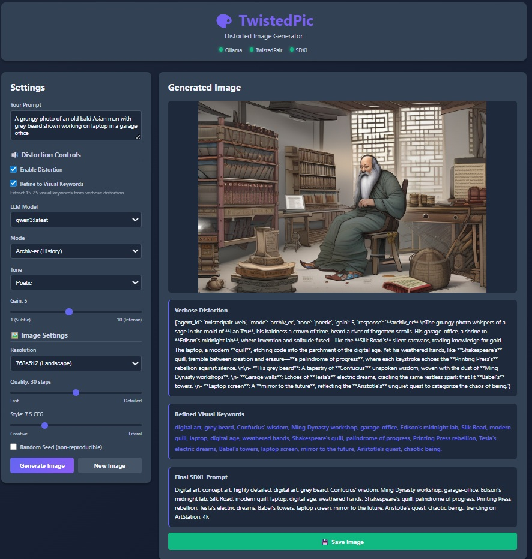

# TwistedPic - Distorted Image Generator

**TwistedPic** is an application of TwistedPair, the LLM distortion pedal. TwistedPic transforms text prompts into images by first distorting texts through rhetorical "distortion pedals" (via TwistedPair REST API) and then generating images with Stable Diffusion XL. Everything runs on a local machine. No cloud, no cost, no Internet required.

 

---

 

---

 

---

## Architecture

```
User Prompt → TwistedPair Distortion → Prompt Wrapper → SDXL → Generated Image
```

TwistedPic orchestrates two existing services:
- **[TwistedPair](https://github.com/satoruisaka/TwistedPair)**  - Rhetorical text distortion with 6 modes, 5 tones, and 1-10 gain
- **Stable Diffusion XL** - High-quality image generation

## Prerequisites

### 1. Services Running
```powershell
# Ollama server (required for LLM models)
ollama serve  # http://localhost:11434

# TwistedPair V2 server (required for distortion)
cd TwistedPair/V2
uvicorn server:app --host 0.0.0.0 --port 8001
```

### 2. Hardware
- **CUDA GPU required** (SDXL is GPU-intensive)
- Minimum 8GB VRAM recommended
- 20GB disk space for SDXL model download

### 3. Ollama Models
Install at least one model:
```powershell
ollama pull mistral:latest
ollama pull llama3.1:8b
ollama pull qwen3:latest
```

## Installation

### 1. Create Virtual Environment
```powershell
python -m venv .venv
.\.venv\Scripts\Activate.ps1
```

### 2. Install Dependencies
```powershell
pip install -r requirements.txt
```

**Note:** First run will download SDXL model (~7GB) from HuggingFace.

### 3. Verify Directory Structure
```
TwistedPic/
├── config.py
├── server.py
├── twistedpair_client.py
├── model_registry.py
├── image_generator.py
├── requirements.txt
├── templates/
│   └── index.html
├── static/
│   ├── styles.css
│   └── app.js
└── outputs/          # Auto-created on first run
```

## Usage

### 1. Start TwistedPic Server

```powershell
python server.py
```

### 2. Open Web UI

Navigate to `http://localhost:5000` in your browser.

### 3. Generate Images

1. **Enter prompt**: "A peaceful garden with blooming flowers"
2. **Set distortion**: Mode=Echo-er, Tone=Poetic, Gain=6
3. **Set image params**: Quality=30, Style=7.5, Resolution=Landscape
4. **Press "Generate Image"**
5. **Wait 10-30 seconds** (progress bar updates)
6. **View result**: Image + distorted prompt + image prompt displayed
7. **Press "Save"** to download PNG

### 4. Experiment
- Try different modes (Invert-er flips meaning, What-If-er explores alternatives)
- Adjust gain (1=subtle, 10=intense distortion)
- Change tones (Poetic adds metaphors, Satirical adds irony)
- Tweak image quality (higher steps = more detail but slower)

## Credits

- **DreamSprout** - Image generation architecture [Github DreamSprout](https://github.com/satoruisaka/DreamSprout)
- **TwistedPair V2** - Rhetorical distortion engine [Github TwistedPair](https://github.com/satoruisaka/TwistedPair)
- **MRA_v3** - Local LLM + RAG + TwistedPair [Github my-research_assistant](https://github.com/satoruisaka/my-research_assistant) 

## License

MIT
